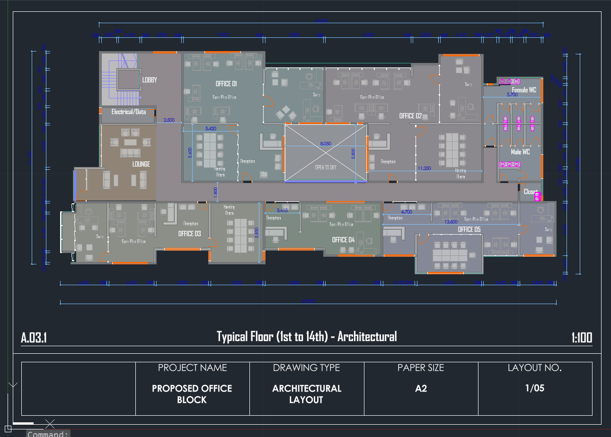
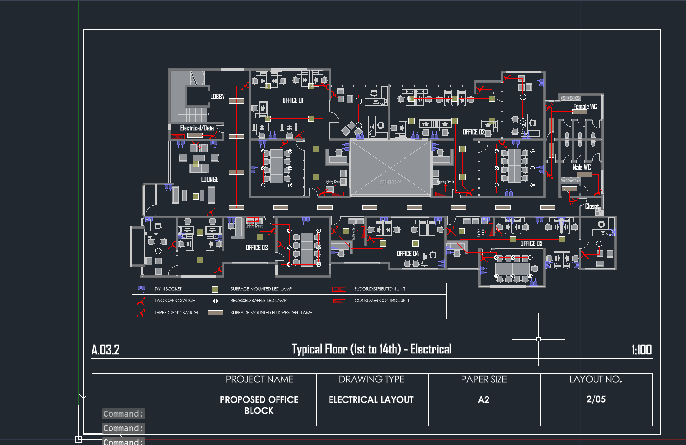
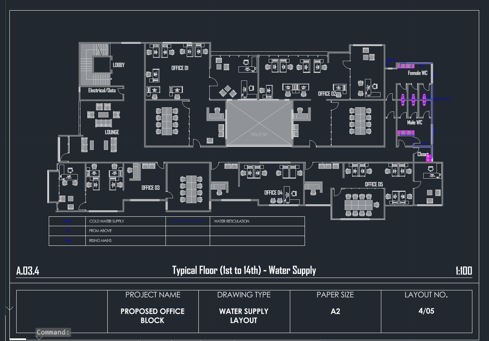
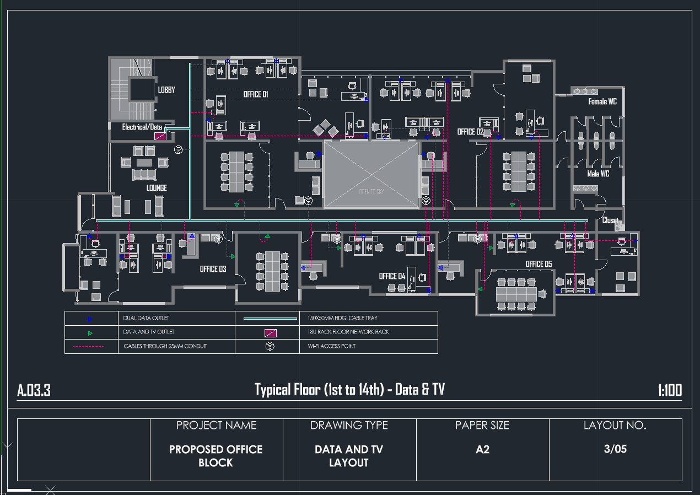

# Smart Infrastructure Simulation for a 14-Unit Commercial Building

## Introduction

This project presents a technical simulation of infrastructure systems for a **14-unit Commercial building**. The goal of the project is to demonstrate how essential building services can be planned, layered, and documented using CAD design principles.

The design models three critical infrastructure pipelines that support modern Commercial buildings:

- Electrical power distribution
- Water supply and plumbing
- WiFi / data network infrastructure

Each system is designed and represented on **separate layers** to ensure clarity, maintainability, and professional drafting standards. The project demonstrates how digital building plans can be used to visualize infrastructure deployment before construction.

---
### Group Members

1. BSCCS/2023/67094-Clifford Mbithuka
2. BSCCS/2023/62916-Yvonne Maigo 
3.  BSCCS/2023/60311-Linah Wanjiku 
4. BSCCS/2023/61886-Michael Maina 
5. BSCCS/2023/59987-Gloria Jebichii
6. BSCCS/2023/64831-Owuor Akinyi 
7. BSCCS/2023/60264- Ahmed Abdirizak
8. BSCCS/2023/68501-Sarah Githinji  
9. BSCCS/2023/66238-Ishak Twahir
10. Dak Kunot BSCCS/2023/51238
11. Valery Mwiti - BSCCS/2023/62743
12. Mandeq Adan - Bsccs/2024/34000

## Project Description

The project simulates the infrastructure planning of a **14-house Commercial building layout**. The model focuses on how essential utilities are routed throughout the building to provide reliable services to all housing units.

The infrastructure has been divided into three independent pipeline systems:

1. **Electricity Distribution System**
2. **Water Supply and Plumbing System**
3. **WiFi / Data Network System**

These systems are designed in AutoCAD using structured layers and schematic representations that mimic real-world engineering drawings used during building construction and facility planning.

The goal is not architectural perfection but rather the **simulation of utility infrastructure deployment within a multi-unit Commercial structure**.

---

## Submission Objective

The objective of this submission is to demonstrate the ability to:

- Design infrastructure layouts using CAD tools
- Separate building utilities using layered technical drawings
- Simulate infrastructure distribution within a multi-unit Commercial structure
- Present organized technical documentation for building systems

The project showcases the integration of **utility planning and digital drafting techniques** within a simulated Commercial building environment.

---

## Construction Goals and Design Details

The infrastructure design focuses on ensuring that all 14 housing units receive reliable access to essential services through structured pipeline layouts.

Key design considerations include:

- Centralized distribution points for utilities
- Logical routing of pipelines and cables
- Separation of systems for easier maintenance
- Clear labeling and documentation of infrastructure elements

Each infrastructure system is represented in its own design pipeline as described below.

---

# Infrastructure Systems

# Ground Floor Layout

The ground floor plan represents the structural layout used as the base for all infrastructure pipelines.

It defines:

- Unit arrangement
- Core circulation areas
- Infrastructure routing paths

All pipelines were designed based on this layout to ensure proper alignment with the building structure.

### Ground Floor Plan

## 1. Electrical Power Distribution

The electrical pipeline simulates how power is distributed throughout the building from a **Main Distribution Board (MDB)**.

The design includes:

- A centralized **Main Distribution Board**
- Electrical routing pathways supplying each housing unit
- Power distribution lines designed for clarity and maintenance access
- Layered CAD representation to isolate electrical infrastructure from other systems

This system ensures that electricity is distributed efficiently across the building while maintaining organized wiring pathways.

---
### Electrical Plan

### Electrical Distribution Layout

---

## 2. Water Supply and Plumbing System

The water supply pipeline simulates how water is distributed from the main supply source to all Commercial units.

The design includes:

- Main water supply entry point
- Branching pipelines supplying individual units
- Structured plumbing routes for efficient water delivery
- Organized layering for plumbing infrastructure

The pipeline structure reflects typical Commercial plumbing distribution systems used in multi-unit buildings.

### Water Plumbing

.png)

### Water Supply Pipeline

---

## 3. WiFi / Data Network Infrastructure

The WiFi and data network system simulates connectivity infrastructure across the building. The goal is to ensure that all housing units receive stable internet connectivity.

The design includes:

- Central network entry point
- Data cabling routes to housing units
- Logical placement of network distribution points
- Layered representation of communication infrastructure

This pipeline demonstrates how network infrastructure can be planned alongside other building utilities without interference.

### Network Plan

### Network Infrastructure

---

# Technologies Used

- **AutoCAD** – Infrastructure drafting and simulation
- **Layered CAD Design** – System separation and clarity
- **Technical Drawing Standards** – Infrastructure planning

---

---

# Conclusion

This project demonstrates a simplified simulation of infrastructure planning for a **14-unit Commercial building** using CAD drafting techniques.

By separating the building services into independent pipeline systems (electricity, water, and network), the design promotes better organization, easier maintenance, and clearer documentation.

The simulation highlights how digital drafting tools can be used to visualize and plan building utilities before physical construction, helping engineers and designers anticipate infrastructure requirements early in the design process.

Future improvements could include:

- Integration with full architectural building plans
- More detailed infrastructure specifications
- Expansion into additional building systems such as HVAC and security networks

---

# Author

Project developed as part of an academic technical submission.

